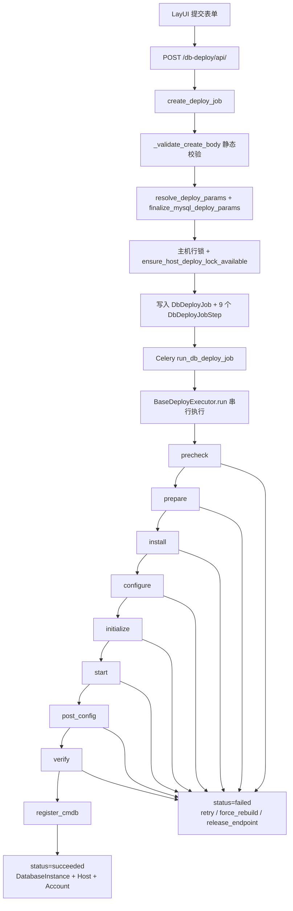

# MySQL 单实例部署 — 执行步骤说明

描述 `mysql_standalone` 任务 9 个步骤的动作与代码对应关系（适用于 5.7 / 8.0 等 Profile）。

## 执行总览

### 端到端流程



```
创建任务 → resolve_deploy_params()（OS/端点/server_id/主机锁校验）
         → Celery run_db_deploy_job
         → MysqlStandaloneExecutor.run()
              precheck      → Python 预检 + Ansible precheck
              prepare~verify  → ansible-playbook --tags <step_code>
              register_cmdb   → Django ORM
```

Playbook：`deploy/playbooks/mysql/standalone/site.yml`，参数经 `resolved_params` 传入 Ansible 变量 `deploy`（Playbook 内 `d: "{{ deploy }}"`）。

### 九步职责一览

| 顺序 | step_code | 名称 | 主要动作 |
|:---:|-----------|------|----------|
| 1 | `precheck` | 预检查 | Python 解释器 + Ansible 目标机环境/软件/实例/端口/介质/glibc |
| 2 | `prepare` | 环境准备 | force_rebuild 清理；建用户/目录；必要时再次 HEAD 介质 |
| 3 | `install` | 安装软件 | 按需下载解压；`package_ref` 建软链；写 PATH |
| 4 | `configure` | 配置文件 | 写 `my.cnf`（5.7/8.0 分支） |
| 5 | `initialize` | 初始化 | `mysqld --initialize-insecure` |
| 6 | `start` | 启动服务 | systemd `mysqld{port}` + 引导期 client cnf |
| 7 | `post_config` | 后置配置 | root 密码、DBA 账号、bind-address→0.0.0.0 |
| 8 | `verify` | 连通验证 | `SELECT VERSION()`，写入 `result.detected_version` |
| 9 | `register_cmdb` | 注册台账 | `DatabaseInstance` / `DatabaseInstanceHost` / `DatabaseAccount` |

### 路径约定与三层模型

端口 3306 示例；由 `build_mysql_install_paths()` / `finalize_mysql_deploy_params()` 生成。

| 层级 | 含义 | 路径（3306 示例） |
|------|------|-------------------|
| **软件层**（同机共享） | 二进制与软链 | `/usr/local/mysql` → `/usr/local/{{ package_ref }}` |
| **实例层**（按端口隔离） | 本任务数据与配置 | `/data/mysql3306/`（`my.cnf`、`data/`、`binlog/`、`mysqld3306.service`） |
| **网络层** | 本任务监听端口 | `cmdb.port`（如 3306） |

| 项 | 路径 |
|----|------|
| 实例根目录 | `/data/mysql3306` |
| 参数文件 | `/data/mysql3306/my.cnf` |
| 数据目录 | `/data/mysql3306/data` |
| Socket | `/data/mysql3306/mysql.sock` |
| 系统服务 | `mysqld3306.service` |

现场判断与 force_rebuild 决策见 [db-deploy-mysql-install-decision-guide.md](./db-deploy-mysql-install-decision-guide.md)。

---

## 1. 预检查（precheck）

precheck **分两段**：创建任务时的 **Django 静态校验**（无需 SSH），以及执行时的 **precheck 步骤**（Python + Ansible）。

### 1.1 阶段 A：创建任务（Django API，未 SSH）

在 `create_deploy_job()` → `_validate_create_body()` / `resolve_deploy_params()` / `finalize_mysql_deploy_params()` 中完成。

| 顺序 | 校验项 | 实现 |
|:---:|--------|------|
| 1 | 部署类型、主机、环境、业务、Profile | `_validate_create_body` |
| 2 | 实例名唯一 | `DatabaseInstance.instance_name` |
| 3 | MySQL root 密码、端口 1024–65535 | `_validate_create_body` |
| 4 | GTID 必须先开 Binlog | `_validate_create_body` |
| 5 | `connect_host` = 目标主机业务 IPv4 | `validate_mysql_deploy_connect_host` |
| 6 | Profile 合并 + OS 规则 | `resolve_deploy_params` → `deploy_os_compat` |
| 7 | 端点 `(connect_host, port, db_name)` 唯一 | `ensure_deploy_endpoint_available`（CMDB + `pending/prechecking/running/verifying/failed` 任务） |
| 8 | `server_id` 唯一（开 binlog 时） | `build_mysql_server_id` + `ensure_mysql_server_id_available` |
| 9 | 同主机无其它进行中部署 | `ensure_host_deploy_lock_available`（`select_for_update` 主机行） |
| 10 | `deploy_job_id` 写入快照 | 任务入库后再次 `resolve_deploy_params` |

此阶段**不做**目标机端口探测、datadir 存在性检查（需 SSH，在阶段 B）。

### 1.2 阶段 B：precheck 步骤（Executor）

```
BaseDeployExecutor._run_precheck()
  ├─ ensure_python_interpreter(host_id)   # 目标机须有可用 Python ≥3.8
  └─ ansible-playbook site.yml --tags precheck
```

Job 状态变为 `prechecking`；任一步失败则任务 `failed`，后续步骤不执行。

### 1.3 阶段 B：Ansible precheck 任务顺序

#### （1）主机环境

| 顺序 | 检查项 | 失败条件 |
|:---:|--------|----------|
| 1 | `gather_facts` | — |
| 2 | 归一化 OS family | centos / rhel / anolis / alinux |
| 3 | Profile `supported_os_rules` | 发行版 major 不在规则内 |
| 4 | CPU 架构 | 不在 `supported_arch`（默认 x86_64） |

#### （2）软件层 — 共享 `/usr/local/mysql`

| 顺序 | 检查项 | 逻辑 |
|:---:|--------|------|
| 5 | `stat {{ basedir }}/bin/mysqld` | 软链/basedir 是否已有程序 |
| 6 | `stat {{ package_ref }}/bin/mysqld` | Profile 介质目录是否已解压 |
| 7 | 解析 basedir 完整版本 `x.y.z` | basedir 存在但解析失败 → **失败** |
| 8 | basedir **major** vs Profile major | 不一致 → **失败**（同机不能混 major） |
| 9 | 解析 package_ref 目录版本 | basedir 不存在时：package 存在但解析失败或 major 不符 → **失败** |
| 10 | 设置 `mysql_need_software_install` | basedir 不存在 → `true`；存在则完整版本 `< Profile` → `true`，否则 `false` |

软件层结论：

- basedir 版本 ≥ Profile 时 `mysql_need_software_install=false`，**install 步可跳过**（仅装新端口实例）。
- major 不一致（如主机已有 8.0、却要装 5.7 Profile）→ **precheck 失败**。

#### （3）实例层 — `/data/mysql{port}/`

| 顺序 | 检查项 | 逻辑 |
|:---:|--------|------|
| 11 | `stat {{ datadir }}/mysql` | 数据目录是否已初始化 |
| 12 | 实例数据目录冲突 | 目录存在 **且** 非 `force_rebuild` → **失败** |

仅检查**本任务端口**对应目录，不扫描其它端口实例。

#### （4）网络层 — 本任务 `cmdb.port`

| 顺序 | 检查项 | 逻辑 |
|:---:|--------|------|
| 13 | 端口探测脚本 | 输出 `free` / `platform` / `foreign` |
| 14 | `foreign` | **始终失败**（含 `force_rebuild`） |
| 15 | `platform` 且非 `force_rebuild` | **失败**，提示使用「强制重建」 |

**端口归属探测逻辑**（`mysql_port` = 本任务 `cmdb.port`，`CNF` = 本任务 `my.cnf`）：

```text
ss -lntH sport=:PORT 无监听          → free
systemctl is-active mysqld{PORT}     → platform
ps mysqld 且 cmdline 含本任务 my.cnf → platform
否则                                 → foreign（附 ss 详情）
```

| 归属 | 含义 | 普通部署 | force_rebuild |
|------|------|:--------:|:-------------:|
| `free` | 端口空闲 | ✅ | ✅ |
| `platform` | 本任务 `mysqld{port}` 或本任务 `my.cnf` | ❌ | ✅（prepare 会 stop） |
| `foreign` | yum / 手工 / 其它服务占用 | ❌ | ❌ |

#### （5）介质与 glibc

| 顺序 | 检查项 | 逻辑 |
|:---:|--------|------|
| 16 | 目标机 `HEAD media.download_url` | 非 200/301/302 → **失败** |
| 17 | 探测 OS glibc | Profile 有 `package_glibc_version` 时执行 |
| 18 | OS glibc ≥ 包要求 | 否则 **失败** |

> Profile 的 `min_memory_gb` **当前 precheck 未强制执行**。

### 1.4 三层模型在 precheck 中的对应关系

precheck 包含**网络 / 实例 / 软件**三层判断（另加主机环境、介质、glibc）：

```text
┌─────────────────────────────────────────────────────────┐
│ 网络层  §1.3(4) 端口探测 → mysql_port_owner            │
│         free / platform / foreign                       │
├─────────────────────────────────────────────────────────┤
│ 实例层  §1.3(3) {{ datadir }}/mysql 存在性              │
│         force_rebuild 可跳过                            │
├─────────────────────────────────────────────────────────┤
│ 软件层  §1.3(2) basedir + package_ref 版本与 major      │
│         → mysql_need_software_install（供 install 用）  │
└─────────────────────────────────────────────────────────┘
```

**代码执行顺序**：软件层 → 实例层 → 网络层 → 介质/glibc。三层相互独立，须分别通过（例如端口 `free` 但 datadir 有残留仍会失败）。

### 1.5 precheck 与 prepare / install 的衔接

| 阶段 | 与三层关系 | 详见 |
|------|------------|------|
| **prepare** | force_rebuild 清**实例层**；按需 HEAD 介质；建用户/目录 | §2 |
| **install** | 重算 `mysql_need_software_install`；装/升级**软件层**；升级前检查其它 `mysqld*` | §3 |

---

## 2. 环境准备（prepare）

```
ansible-playbook site.yml --tags prepare
```

Job 状态为 `running`。本步**不再重复** precheck 的三层校验（端口/datadir/软件版本），主要负责 **force_rebuild 清实例**、**介质可达性补检**、**建用户与目录**。

> **步骤隔离**：每次 `--tags` 为独立 Ansible 运行，precheck 设置的 `mysql_need_software_install` **不会**传入 prepare。prepare 中该变量未定义时使用 `default(true)`，见 §2.4。

### 2.1 Ansible prepare 任务顺序

#### （1）force_rebuild — 清理实例层（仅 `meta.force_rebuild=true`）

| 顺序 | 任务 | 动作 | 说明 |
|:---:|------|------|------|
| 1 | 停止 systemd | `systemctl stop/disable mysqld{port}` | `failed_when: false`，stop 失败不阻断 |
| 2 | 删除 unit 文件 | 删除 `/etc/systemd/system/mysqld{port}.service` | `daemon_reload` 已在 stop 任务触发 |
| 3 | 删除实例根目录 | `file: state=absent` → `{{ instance_root }}` | 含 `my.cnf`、`data/`、`binlog/` 等 |
| 4 | 清理临时文件 | 删除 `/tmp/dbatoolbox_mysql_*` | 含 legacy cnf、root/admin SQL |

**不做**：不删除 `/usr/local/mysql`、不删 `package_ref` 解压目录、不 `pkill` 非 systemd 拉起的 mysqld（若存在，端口可能残留到 `start` 才暴露）。

#### （2）介质就绪探测

| 顺序 | 任务 | 逻辑 |
|:---:|------|------|
| 5 | `stat {{ mysql_package_dir }}/bin/mysqld` | 检查 Profile `package_ref` 目录是否已有程序 |
| 6 | 设置 `mysql_prepare_need_download` | `(mysql_need_software_install \| default(true))` **且** 上一步不存在 → `true` |
| 7 | 目标机 HEAD `media.download_url` | 仅当 `mysql_prepare_need_download=true` 时执行；非 200/301/302 → **失败** |

`mysql_package_dir` = `/usr/local/{{ d.media.package_ref }}`（与 precheck/install 一致）。

#### （3）系统用户与目录

| 顺序 | 任务 | 路径 / 属性 |
|:---:|------|-------------|
| 8 | 创建组 `mysql` | `group: present` |
| 9 | 创建用户 `mysql` | `system` 用户，`/sbin/nologin`，无 home |
| 10 | 创建实例目录 | `{{ instance_root }}`、`{{ datadir }}`，`mysql:mysql`，`0750` |
| 11 | 创建软件父目录 | `{{ mysql_basedir \| dirname }}`（通常 `/usr/local`） |
| 12 | 创建 binlog 目录 | `{{ binlog_dir }}`，仅 `enable_binlog=true` 时 |

### 2.2 prepare 与三层模型

| 层级 | prepare 职责 |
|------|--------------|
| **实例层** | force_rebuild 时删除 `instance_root`；否则仅确保目录存在（空目录） |
| **软件层** | 确保 `/usr/local` 存在；**不**安装/升级二进制 |
| **网络层** | **不**复核端口（依赖 precheck；续跑跳过 precheck 时存在时间窗风险） |

### 2.3 与 precheck 的差异

| 项 | precheck | prepare |
|----|----------|---------|
| 端口/datadir/版本 | 全量检查 | 不检查 |
| 介质 HEAD | 始终执行 | 仅「可能需下载」时执行 |
| force_rebuild 清理 | 不执行 | 执行 stop/删目录 |
| 创建 mysql 用户 | 不执行 | 执行 |

### 2.4 实现注意（`mysql_need_software_install`）

prepare 判定下载需求时使用：

```yaml
mysql_prepare_need_download: (mysql_need_software_install | default(true)) and not package_dir_exists
```

因 prepare 单独跑 tag、**未在本步重算** `mysql_need_software_install`，`default(true)` 在 basedir 已满足版本时可能**高估**下载需求。常见现场：

- `package_ref` 目录已存在 → `prepare_need_download=false`，不 HEAD，**无影响**
- basedir 可用但 `package_ref` 路径不存在 → 可能多一次 HEAD；介质不可达时 **prepare 误失败**（install 本可跳过下载）

---

## 3. 安装软件（install）

```
ansible-playbook site.yml --tags install
```

本步只处理**软件层**（共享 `/usr/local/mysql`），在 install 内**重新计算** `mysql_need_software_install`（与 precheck 结论应对齐，但互不传 fact）。

### 3.1 `mysql_need_software_install` 判定（install 内重算）

| 条件 | `mysql_need_software_install` |
|------|:----------------------------:|
| `{{ basedir }}/bin/mysqld` 不存在 | `true` |
| 存在且 `mysqld --version` 完整版本 **<** Profile `major.minor` | `true` |
| 存在且版本 **≥** Profile | `false`（跳过下载/解压/建链/改权限） |

完整版本比较使用 Ansible `version` 过滤器；major 不一致应在 precheck 已失败，install 不再单独拦 major。

### 3.2 Ansible install 任务顺序

#### （1）判定与升级门禁

| 顺序 | 任务 | 逻辑 |
|:---:|------|------|
| 1 | `stat {{ basedir }}/bin/mysqld` | basedir 是否有程序 |
| 2 | `stat {{ mysql_package_dir }}/bin/mysqld` | `package_ref` 目录是否已有解压产物 |
| 3 | 解析 basedir 完整版本 | `mysqld --version` → `x.y.z` |
| 4 | 设置 `mysql_need_software_install` | 见 §3.1 |
| 5 | 列出其它运行中 `mysqld*.service` | 排除本任务 `mysqld{port}.service` |
| 6 | 其它实例仍在运行 | 当需要装/升级软件时 → **失败**（须先停其它实例） |

门禁 5–6 保护同机共享软件升级：改 `/usr/local/mysql` 会影响所有实例。

#### （2）下载与解压（仅 `mysql_need_software_install=true`）

| 顺序 | 任务 | 说明 |
|:---:|------|------|
| 7 | `get_url` | 下载到 `/tmp/{{ d.media.filename }}`；**仅**当 `package_ref` 目录不存在 |
| 8 | `unarchive` | 解压到 `/usr/local`（`mysql_basedir \| dirname`）；`creates: {{ mysql_package_dir }}/bin/mysqld` 幂等 |
| 9 | 刷新 `stat` package 目录 | 确认解压后 `mysqld` 存在 |
| 10 | package 目录缺失 | 需要装软件但目录仍不存在 → **失败** |

介质来源：`resolved_params.media.download_url`（Profile `media_base_url` + `package_filename`）。

#### （3）软链、权限、PATH（仅 `mysql_need_software_install=true`）

| 顺序 | 任务 | 说明 |
|:---:|------|------|
| 11 | 建立软链接 | `/usr/local/mysql` → `/usr/local/{{ package_ref }}`，`force: true` |
| 12 | `chown -R mysql:mysql` | 作用于 **`package_ref` 目录**（非 basedir 递归误伤） |
| 13 | 确认 `basedir/bin/mysqld` 存在 | 软链完成后 stat |
| 14 | 写入 `/etc/profile` | `blockinfile` 幂等追加 `export PATH=/usr/local/mysql/bin:$PATH`（marker `DBATOOLBOX MANAGED`） |

### 3.3 跳过 install 主路径时

当 `mysql_need_software_install=false`（basedir 版本已 ≥ Profile）：

- 跳过：下载、解压、建链、`chown` package 目录
- **仍执行**：步骤 1–4 判定；步骤 13–14 确认 mysqld 存在并确保 PATH（若 basedir 已有则 PATH 块仍可能执行）

典型场景：同机已装 5.7.44，新部署端口 3307，仅走 configure 之后步骤装新实例。

### 3.4 `package_ref` 数据流（install 相关）

```text
deploy/profiles/mysql/*.yml  →  package_ref: mysql-5.7.44-linux-glibc2.12-x86_64
        ↓ profile_loader.build_media_info()
resolved_params.media.package_ref
        ↓ Ansible d.media.package_ref
mysql_package_dir = /usr/local/{package_ref}
        ↓ unarchive creates / file link src
/usr/local/mysql  →  /usr/local/{package_ref}
```

`package_ref` 须与压缩包内顶层目录名一致，由 Profile YAML 维护，用户表单不可覆盖。

### 3.5 install 与三层模型

| 层级 | install 职责 |
|------|--------------|
| **软件层** | 下载/解压/软链/权限/PATH；升级前检查其它 `mysqld*` 服务 |
| **实例层** | **不**处理（datadir 在 prepare 已建空目录） |
| **网络层** | **不**处理 |

### 3.6 与 precheck 的衔接

| 检查项 | precheck | install |
|--------|----------|---------|
| 软件版本 / major | ✅ 失败则不到 install | ✅ 重算 `need_install` |
| 同机其它 mysqld 服务 | ❌ | ✅ 仅升级/新装软件时 |
| 下载介质 | HEAD（始终） | `get_url`（按需） |
| package_ref 目录 | stat + 版本 | stat + 解压 + 建链 |

---

## 4. 配置文件（configure）

生成 `my.cnf`：`bind-address=127.0.0.1`（引导期）；5.7/8.0 在 playbook 内按 `mysql_profile_major` 分支 collation、认证插件。

---

## 5. 初始化（initialize）

```bash
mysqld --defaults-file={{ cnf }} --initialize-insecure --user=mysql
```

`creates: {{ datadir }}/mysql`。

---

## 6. 启动（start）

- 写入引导期 `{{ instance_root }}/.root-client.cnf`（仅 socket）
- systemd `mysqld{port}.service`；`ExecStop` 使用 `defaults-extra-file`

---

## 7. 后置配置（post_config）

- 设 root 密码（socket / 空密码 / 已生效检测）
- 更新 `.root-client.cnf` 含密码
- 创建 DBA 账号（`dba_grant_statements`）
- `bind-address` → `0.0.0.0` 并 restart
- 删除 `/tmp/dbatoolbox_mysql_*.sql`

---

## 8. 验证（verify）

```bash
mysql --defaults-extra-file={{ instance_root }}/.root-client.cnf -Nse "SELECT VERSION();"
```

- 运行版本须 **≥** Profile `major.minor`
- 写入 `job.result.detected_version`

---

## 9. 注册台账（register_cmdb）

`register_instance_from_job()`：`DatabaseInstance`、`DatabaseInstanceHost`、`DatabaseAccount`（root + DBA）。端点冲突时 `IntegrityError` 转可读错误。

---

## 失败恢复

与 precheck 三层相关的常见场景：

| 场景 | 操作 |
|------|------|
| 实例目录残留（实例层） | `force_rebuild` → prepare 清理后重跑 |
| 端口 platform 占用（网络层） | `force_rebuild` |
| 端口 foreign（网络层） | 换端口或人工下线，无法 force_rebuild |
| failed 任务占端点（阶段 A） | `release_endpoint` 后新建任务 |
| 某步失败后续跑 | `retry`：从失败步继续，**不刷新** `resolved_params` |

| 操作 | API `action` | 要点 |
|------|--------------|------|
| 续跑 | `retry` | 仅重置失败步及之后；**不**刷新 `resolved_params`；跳过 `succeeded` 步 |
| 全量重跑 | `retry`（cancelled 等） | 重置全部步骤并刷新 `resolved_params` |
| 强制重建 | `force_rebuild` | 仅 `mysql_standalone`、未注册台账；`meta.force_rebuild=true`；prepare 清实例目录 |
| 释放端点 | `release_endpoint` | 仅 `failed`、未注册台账 → `cancelled`，释放同 IP:端口；见 [db-deploy-mysql-endpoint-release.md](./db-deploy-mysql-endpoint-release.md) |

`force_rebuild` 结束后自动清除 `force_rebuild` 标记。清理范围仅 `instance_root`，不删 `/usr/local/mysql`。

---

## 相关文件

| 文件 | 职责 |
|------|------|
| `apps/dbmgr/deploy_constants.py` | 步骤、路径、端点/server_id/主机锁 |
| `apps/dbmgr/deploy_services.py` | 任务 CRUD、续跑、force_rebuild、release_endpoint |
| `apps/dbmgr/deploy_executors/base.py` | 步骤编排 |
| `apps/dbmgr/profile_loader.py` | Profile 合并 |
| `deploy/playbooks/mysql/standalone/site.yml` | Ansible 各步 |
| `deploy/profiles/mysql/*.yml` | 版本档案 |

决策与现场判断见 [db-deploy-mysql-install-decision-guide.md](./db-deploy-mysql-install-decision-guide.md)。
